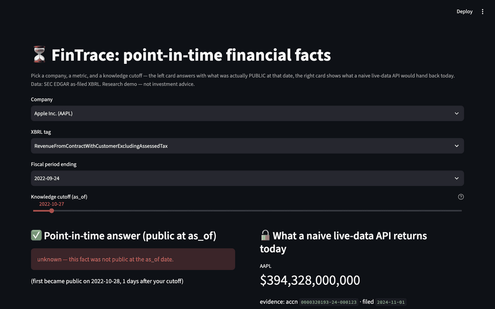

# FinTrace · PITfall

Auditable, point-in-time financial research agents & the PITfall leakage-controlled
benchmark — every claim traceable to as-filed evidence, zero look-ahead.

> ⚠️ Research software under active development. Not investment advice.

🧪 **Live demo** (no sign-up, no API key): [fintrace-demo.streamlit.app](https://fintrace-demo.streamlit.app) —
pick a company, a metric, and a knowledge cutoff; watch the point-in-time answer vs what a naive live-data API returns.



- 📍 **Status**: baselines complete — 125M as-filed facts, core-200 benchmark
  (T1 92% / T2 93.3% / T3 50%, bootstrap 95% CI), leakage audit showing a naive
  live-data agent answers 82% of "impossible" questions with the true future
  value. See [`docs/00-STATE.md`](docs/00-STATE.md).
- 💡 Total LLM cost of both full baseline runs: **≈ ¥4.4 (~$0.6)**.

## What's inside

| Module | Purpose |
|---|---|
| `fintrace-data` | Point-in-time EDGAR ingestion: as-filed XBRL facts gated by `filed` timestamps |
| `as_of(T)` | The PIT query primitive shared by runtime and benchmark — no default, no look-ahead |
| `pitfall-bench` | Leakage-controlled benchmark: time-gated QA, claim verification, forward estimation |
| `auditpack` | Open audit-trail schema: claims + evidence chains + execution logs + sign-off |

📄 Technical report (draft): [`reports/technical-report.md`](reports/technical-report.md)

## Results — same benchmark, three configurations

Frozen core-200 (T1×100 incl. 17 *impossible* tasks whose answers were not
public at the reference date / T2×60 / T3×40), deepseek-chat backbone,
bootstrap 95% CIs in the [technical report](reports/technical-report.md).

| configuration | impossible tasks answered with the TRUE future value | T1 time-gated QA | T2 claim verification | T3 forward estimation¹ |
|---|---|---|---|---|
| bare model (GLM-4.7, no tools) | 2/17 (11.8%) | 2% | 55.0% | 12.5% |
| bare model (deepseek-chat, no tools) | 2/17 (11.8%) | 5% | 53.3% | 25.0% |
| naive agent (live-data tools, no time gate) | **14/17 (82%)** | 77% | 86.7% | **80%** |
| **gated FinTrace agent** | **0/17** (16/17 correctly "unknown") | **92%** | **93.3%** | 50% |

¹ T3 pass = APE ≤ 20%. The naive agent's T3 "forecasting" jump (50% → 80%)
and the 82% impossible-question leakage are look-ahead access, not
intelligence: on T1-positive tasks the naive agent is flat vs gated
(93% vs 92%). The pattern replicates across both model families.

Reproduce: `fintrace pitfall-generate` → `pitfall-run` → `pitfall-leak`.

## Quick start (human developers)

```bash
make onboard   # environment check + onboarding reading order
make setup     # install toolchain
make check     # ruff + mypy + pytest
uv run fintrace query-fact --ticker AAPL --tag Revenues --period-end 2022-09-24 --as-of 2023-01-01
```

Every query takes a mandatory `as_of` date by design: asking "what was knowable
at T" is the core contract of this library.

## License

Apache-2.0


